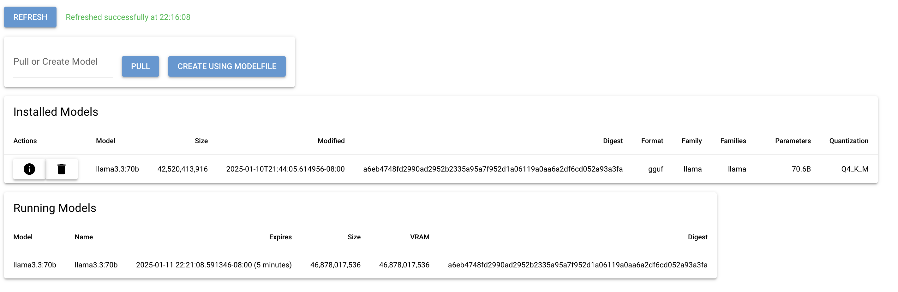

This is a simple web UI wrapping some of the management features of the [Ollama](https://ollama.com/) [API](https://github.com/ollama/ollama/blob/main/docs/api.md).

Currently supports:

- Pulling a model by name
- Creating a model by supplying Modelfile contents
- Listing, viewing details of, and deleting installed models
- Listing running models

Setup instructions:

1. Make sure you have python installed. See the `.python-version` file for the version I tested on.
2. Clone the repo.
3. Install dependencies: `pip install -r requirements.txt`
4. Start the server: `python basic_ollama_management_ui.py http://localhost:11434` (replace the URL with the URL to your Ollama instance)

The CLI also accepts `--host` and `--port` options if you want to bind to something other than `0.0.0.0:8080`, and `--refresh-interval` if you want to override the 60-second refresh interval. During development, you may wish to supply the `--reload` option.

You can have it open a native window (i.e. like a desktop app) by passing `--native`.

This was thrown together quickly using the excellent [NiceGUI](https://nicegui.io) framework 😁

